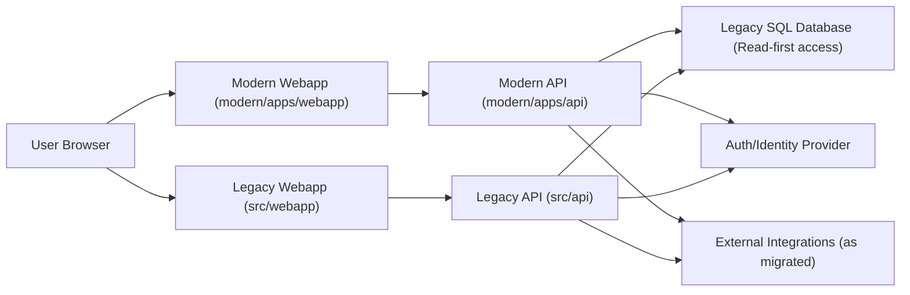

# Modernization Architecture Baseline

## Objectives and Non-Goals

### Objectives

- Define a stable modernization architecture baseline so implementation, review, and QA threads align.
- Keep legacy and modern systems running side-by-side during incremental migration.
- Prevent folder and dependency drift across `modern/apps`, `modern/packages`, and `modern/tests`.
- Establish practical safety rails for migration decisions and code boundaries.

### Non-Goals

- Rewriting legacy runtimes in one step.
- Introducing behavior changes in legacy runtime paths (`src/webapp/**`, `src/api/**`).
- Finalizing all long-term write-path and data ownership decisions in this phase.

## Current State vs Target State

### Current State (coexistence now)

- Legacy webapp: `src/webapp/**` (AngularJS-era runtime) remains production-critical.
- Legacy API: `src/api/**` remains existing backend runtime.
- Modern webapp: `modern/apps/webapp/**` is introduced incrementally.
- Modern API: `modern/apps/api/**` provides new contract-first, read-first endpoints.
- Modern tests: `modern/tests/**` validate modern behavior and contracts.

### Target State (incremental destination)

- Modern apps become primary entry points for migrated features.
- Legacy apps remain available until feature-by-feature replacement is complete.
- Shared modern logic is centralized in `modern/packages/**`.
- Clear boundaries and dependency rules prevent accidental coupling back to legacy internals.

## System Context

- Webapp:
  - Legacy UI remains active in `src/webapp/**`.
  - Modern UI runs in `modern/apps/webapp/**` for migrated journeys.
- API:
  - Legacy API remains active in `src/api/**`.
  - Modern API in `modern/apps/api/**` exposes migration-safe endpoints.
- Data:
  - Legacy SQL schema remains system of record during early migration.
  - Modern API currently uses read-oriented access for migrated read endpoints.
- Auth:
  - Current auth context is derived from authenticated identity and org/tenant headers.
  - Modern API enforces authenticated access for protected endpoints.
- External integrations:
  - Existing integrations continue through legacy ownership until explicitly migrated.
  - Modern integrations should be introduced behind explicit ADRs and contracts.

## High-Level Component Diagram

## Runtime Request Flow (Webapp -> API -> DB)

1. Browser calls modern webapp route in `modern/apps/webapp`.
2. Modern webapp sends HTTP request to modern API (`/api/v1/...`) with auth context and org/tenant headers.
3. Modern API resolves caller identity and org/tenant context.
4. Modern API executes read-path query against legacy schema via read-oriented data access.
5. Modern API maps domain/read model to contract response and returns to webapp.

## Tenant/Org/Auth Model

### Current assumptions

- Request context includes an authenticated user identity.
- Organization and/or tenant context is provided via headers and validated by API middleware/resolvers.
- Endpoint logic assumes identity + organization are required for user-scoped data access.

### Target model

- Tenant/org context becomes explicit and consistently enforced across modern endpoints.
- Header and claims handling converges to a single validated model.
- Authorization policy moves from per-endpoint ad hoc checks toward shared policy-based enforcement.

## Data Access Strategy

- Migration principle: read-first.
- Near-term:
  - Prioritize read-only endpoints that reduce risk and prove contract compatibility.
  - Keep legacy DB as source of truth while modern APIs mature.
- Writes:
  - Write strategy is deferred until invariants, ownership, and rollback design are ADR-backed.
  - Any future write-path work requires dedicated ADRs before implementation.

## Environment Model

- Local:
  - Developer machines run modern webapp/API with local configuration.
  - Legacy dependencies are used as needed for compatibility and testing.
- CI:
  - Root workspace runs lint/typecheck/test/build.
  - Modern API build/tests run via `.sln` commands.
- Staging:
  - Used for integration validation and migration-safe contract checks.
- Production:
  - Legacy remains authoritative for non-migrated features.
  - Modern runtime exposure expands incrementally per migrated surface.

## Observability Baseline

- Logs:
  - Structured request logs for modern API endpoints.
  - Include request correlation identifiers where available.
- Metrics:
  - Track endpoint latency, status code rates, and error counts.
- Health checks:
  - Keep `/health` available for runtime readiness/liveness checks.
- Baseline expectation:
  - Any new modern endpoint must be observable enough for incident triage.

## Security Baseline

- AuthN/AuthZ:
  - Protected modern endpoints require authenticated caller context.
  - Authorization checks must include org/tenant scoping where applicable.
- Secrets:
  - Secrets/config are provided via environment or secure configuration sources, not committed files.
- Headers:
  - Tenant/org/auth headers must be validated and treated as untrusted until resolved.
- Trust boundaries:
  - Browser to API is an untrusted boundary.
  - API to DB and external integrations must use least-privilege access.

## Folder Structure Conventions and Examples

- `modern/apps/*`: deployable modern applications.
  - Example: `modern/apps/webapp`, `modern/apps/api`
- `modern/packages/*`: reusable modern libraries.
  - Example: `modern/packages/foundation`
- `modern/tests/*`: integration/contract test suites for modern apps/packages.
  - Example: `modern/tests/api`
- `modern/docs/*`: modernization architecture, ADRs, reviews, QA docs.

## Dependency Rules

- Apps can depend on packages.
- Packages cannot depend on apps.
- Tests can depend on apps/packages.
- No legacy `src/**` imports or code references from `modern/**`.

## Decision Backlog / Known Gaps

- Final tenant model unification (header/claim canonical contract).
- Write-path migration architecture (ownership, consistency, rollback).
- External integration migration sequencing and strangler boundaries.
- Production observability SLO/SLA definitions for modern endpoints.
- Security hardening backlog (standardized security headers, threat modeling cadence).
